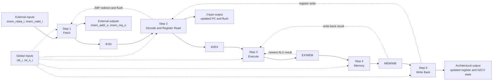
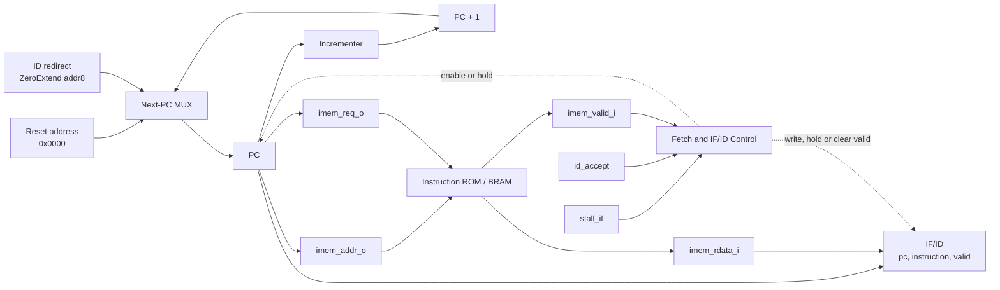
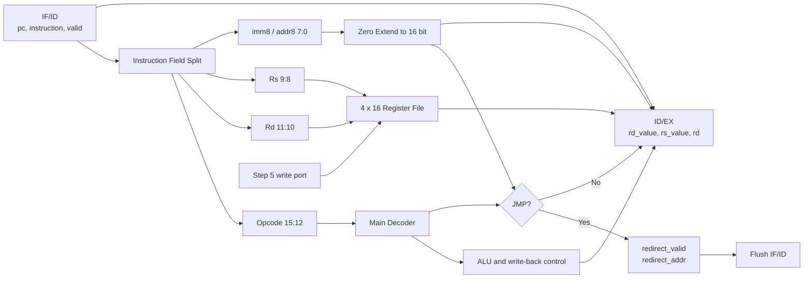
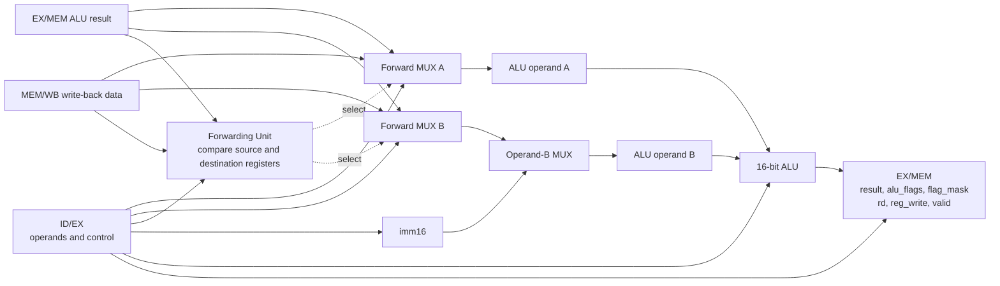
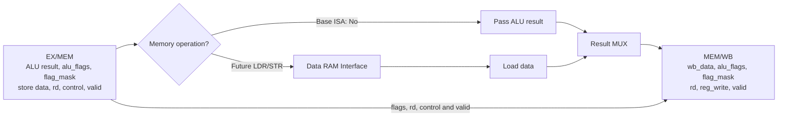
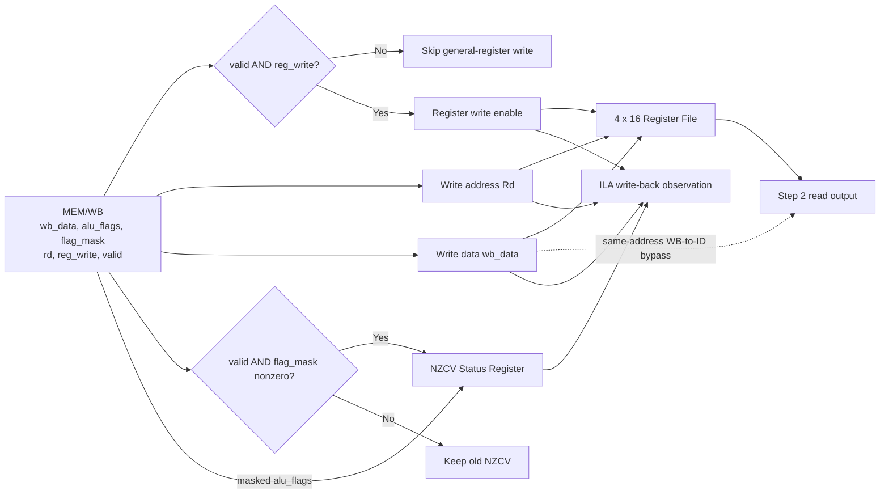
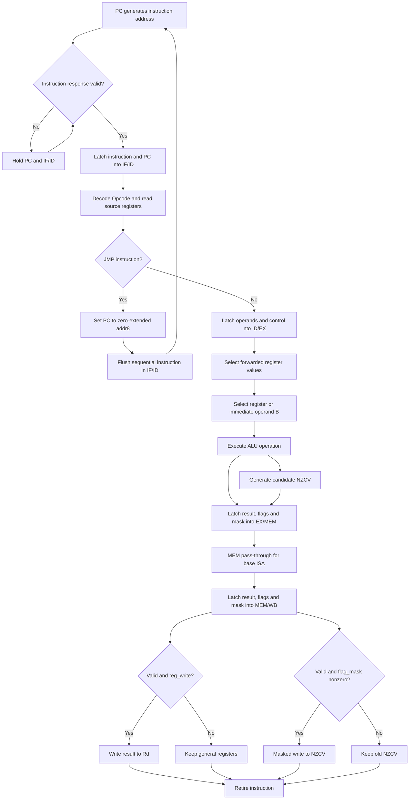
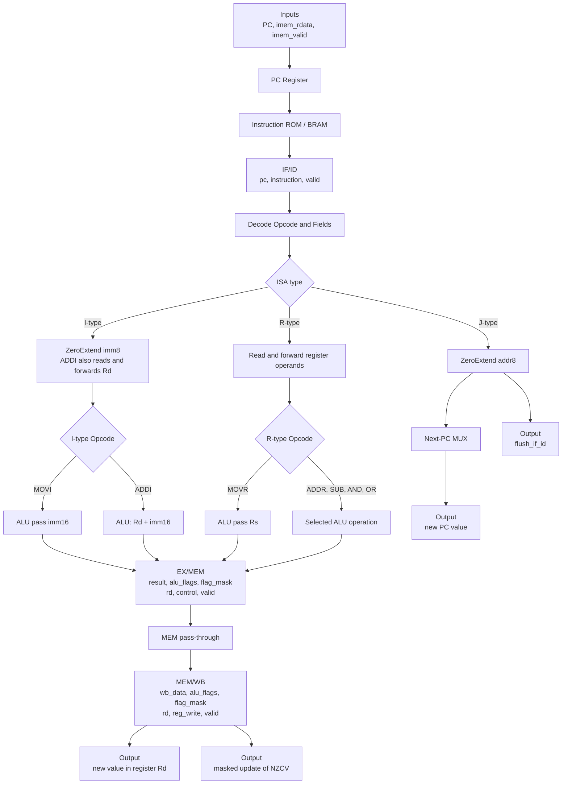

# 16 位八指令流水线 CPU 第一周设计规格

> 文档状态：第一周讨论稿  
> 当前范围：基础 8 条 ISA、总体结构与 Dataflow  
> 设计目标：完成可综合、可仿真、可上板的基础 CPU，并为后续加入 `LDR/STR` 保留扩展位置。

## 1. Team Information

团队名称和成员信息尚未提供，以下表格保留填写位置。任务分配按报告模板和流水线模块划分。

| Team Name | 待填写 |
| --- | --- |

| Student Number | Name | Task | Score |
| --- | --- | --- | --- |
| 待填写 | 待填写 | Datapath 与流水线寄存器设计、实现 | 待填写 |
| 待填写 | 待填写 | Controller、冒险检测与旁路设计、实现 | 待填写 |
| 待填写 | 待填写 | ISA 测试程序与 Testbench 设计 | 待填写 |
| 待填写 | 待填写 | FPGA 集成、ILA 调试与结果整理 | 待填写 |

## 2. Specification

### 2.1 Requirements Analysis

本项目设计一款 16 位 RISC CPU。第一阶段实现课程 PPT 给出的 8 条基础指令，包括数据传送、算术、逻辑和无条件跳转；处理器采用流水线结构，并使用 Verilog HDL 实现。设计必须能够直接完成仿真和综合，之后连接 FPGA 片上指令存储器，通过 ILA 观察 PC、指令、流水线有效位和寄存器写回结果。

当前设计需满足以下要求：

- 指令和数据宽度均为 16 bit，PC 按 16 位指令字寻址，每取一条顺序指令执行 `PC + 1`。
- 提供 4 个 16 位通用寄存器 `R0` 至 `R3`。
- 实现基础 8 条 ISA，并为其余 4 位 Opcode 保留扩展空间。
- 采用 IF、ID、EX、MEM、WB 五级流水线。
- 通过数据旁路消除基础 ALU 指令之间的大部分 RAW 冒险。
- `JMP` 在 ID 级完成目标地址计算和重定向，清除错误路径指令。
- 每级流水线寄存器带 `valid` 位，以统一实现复位、暂停、气泡和清空。
- 指令存储接口带请求和有效握手，可兼容 FPGA 同步 ROM/BRAM。

### 2.2 Application Scenarios

基础 CPU 可运行存放在 FPGA ROM/BRAM 中的小型汇编程序，用于验证寄存器传送、算术逻辑运算和程序跳转。上板阶段可将寄存器或 PC 的低位映射到 LED，形成循环计数、流水灯或状态机演示，并使用 ILA 捕获内部流水线状态。后续加入 `LDR/STR` 和数据存储接口后，可扩展为具有存储访问和外设控制能力的最小处理器系统。

## 3. ISA Definition

### 3.1 Instruction Word

所有指令固定为 16 bit：

```text
15             12 11       10 9         8 7                         0
+----------------+------------+------------+--------------------------+
| Opcode [3:0]   | Rd [1:0]   | Rs [1:0]   | Immediate / Address [7:0]|
+----------------+------------+------------+--------------------------+
```

- `Opcode`：操作码。
- `Rd`：目的寄存器。对双操作数 ALU 指令，它同时也是第一个源操作数。
- `Rs`：第二个源寄存器。
- `Immediate/Address`：8 位无符号立即数或绝对跳转地址。
- 未使用的字段由汇编器填写为 `0`，硬件译码时忽略。

### 3.2 Basic 8-Instruction ISA

完整指令编码中的符号含义如下：

| Symbol | Width | Meaning |
| --- | ---: | --- |
| `dd` | 2 bit | 目的寄存器 `Rd` |
| `ss` | 2 bit | 源寄存器 `Rs` |
| `iiiiiiii` | 8 bit | 无符号立即数 `imm8` |
| `aaaaaaaa` | 8 bit | 无条件跳转的绝对指令地址 `addr8` |
| `0` | 1 bit | 保留位，编码时必须填写为 0 |

寄存器代码固定为：

| Register | 2-bit Code |
| --- | --- |
| `R0` | `00` |
| `R1` | `01` |
| `R2` | `10` |
| `R3` | `11` |

下面模板中的下划线仅用于分隔字段，不属于实际机器码。`Full 16-bit Example` 列是不带分隔符的完整 16 位指令。

#### 3.2.1 I-Type: Immediate Instructions

I-type 使用 `Rd` 和 8 位立即数。位 `[9:8]` 不作为 `Rs` 使用，编码时固定为 `00`。

```text
15          12 11    10 9      8 7                  0
+--------------+--------+--------+--------------------+
| Opcode [3:0] | Rd [1:0]|  00    | imm8 [7:0]       |
+--------------+--------+--------+--------------------+

MOVI: 0000_dd_00_iiiiiiii
ADDI: 0010_dd_00_iiiiiiii
```

| Mnemonic | Assembly | Complete 16-bit Template | Full 16-bit Example | Hex | Operation |
| --- | --- | --- | --- | --- | --- |
| `MOVI` | `MOV Rd, #imm8` | `0000_dd_00_iiiiiiii` | `MOV R1, #0x02` = `0000010000000010` | `0x0402` | `R1 <- 0x0002` |
| `ADDI` | `ADD Rd, #imm8` | `0010_dd_00_iiiiiiii` | `ADD R1, #0x08` = `0010010000001000` | `0x2408` | `R1 <- R1 + 8` |

#### 3.2.2 R-Type: Register Instructions

R-type 使用 `Rd` 和 `Rs`。低 8 位不参与运算，编码时固定为 `00000000`。

```text
15          12 11    10 9      8 7                  0
+--------------+--------+--------+--------------------+
| Opcode [3:0] | Rd [1:0]| Rs[1:0]| 00000000         |
+--------------+--------+--------+--------------------+

MOVR: 0001_dd_ss_00000000
ADDR: 0011_dd_ss_00000000
SUB : 0101_dd_ss_00000000
AND : 0111_dd_ss_00000000
OR  : 1001_dd_ss_00000000
```

| Mnemonic | Assembly | Complete 16-bit Template | Full 16-bit Example | Hex | Operation |
| --- | --- | --- | --- | --- | --- |
| `MOVR` | `MOV Rd, Rs` | `0001_dd_ss_00000000` | `MOV R2, R1` = `0001100100000000` | `0x1900` | `R2 <- R1` |
| `ADDR` | `ADD Rd, Rs` | `0011_dd_ss_00000000` | `ADD R1, R2` = `0011011000000000` | `0x3600` | `R1 <- R1 + R2` |
| `SUB` | `SUB Rd, Rs` | `0101_dd_ss_00000000` | `SUB R1, R2` = `0101011000000000` | `0x5600` | `R1 <- R1 - R2` |
| `AND` | `AND Rd, Rs` | `0111_dd_ss_00000000` | `AND R1, R2` = `0111011000000000` | `0x7600` | `R1 <- R1 AND R2` |
| `OR` | `OR Rd, Rs` | `1001_dd_ss_00000000` | `OR R1, R2` = `1001011000000000` | `0x9600` | `R1 <- R1 OR R2` |

`MOVR` 只使用 `Rs` 作为源操作数；其余 R-type 指令同时读取旧 `Rd` 和 `Rs`，并把结果写回 `Rd`。

#### 3.2.3 J-Type: Jump Instruction

J-type 使用低 8 位作为绝对指令地址。`Rd` 和 `Rs` 字段均固定为 `00`。

```text
15          12 11    10 9      8 7                  0
+--------------+--------+--------+--------------------+
| Opcode [3:0] |   00    |   00   | addr8 [7:0]      |
+--------------+--------+--------+--------------------+

JMP: 1010_00_00_aaaaaaaa
```

| Mnemonic | Assembly | Complete 16-bit Template | Full 16-bit Example | Hex | Operation |
| --- | --- | --- | --- | --- | --- |
| `JMP` | `JMP #addr8` | `1010_00_00_aaaaaaaa` | `JMP #0x01` = `1010000000000001` | `0xA001` | `PC <- 0x0001` |

目标地址按 16 位指令字寻址，并零扩展到 16 位 PC。

以上 Opcode 与课程 `lab2.pptx` 中的基础 ISA 对应。`0100`、`0110`、`1000`、`1011` 至 `1111` 当前保留，后续可分配给 `LDR`、`STR`、条件跳转、移位或比较指令。

### 3.3 ALU and Main Control

沿用课程 PPT 的 3 位 ALU 功能编码：

| `alu_op` | ALU Result |
| --- | --- |
| `000` | `operand_b` |
| `001` | `operand_a + operand_b` |
| `010` | `operand_a - operand_b` |
| `011` | `operand_a AND operand_b` |
| `100` | `operand_a OR operand_b` |

主译码器输出以下控制信号。`uses_rd` 和 `uses_rs` 供旁路及冒险检测单元判断源寄存器依赖。`flag_mask` 按 `{N,Z,C,V}` 排列，位为 1 表示该指令提交时更新对应 Flag。

| Instruction | `reg_write` | `uses_rd` | `uses_rs` | `alu_src_imm` | `alu_op` | `jump` | `flag_mask[NZCV]` |
| --- | ---: | ---: | ---: | ---: | --- | ---: | --- |
| `MOVI` | 1 | 0 | 0 | 1 | `000` | 0 | `1100` |
| `MOVR` | 1 | 0 | 1 | 0 | `000` | 0 | `1100` |
| `ADDI` | 1 | 1 | 0 | 1 | `001` | 0 | `1111` |
| `ADDR` | 1 | 1 | 1 | 0 | `001` | 0 | `1111` |
| `SUB` | 1 | 1 | 1 | 0 | `010` | 0 | `1111` |
| `AND` | 1 | 1 | 1 | 0 | `011` | 0 | `1100` |
| `OR` | 1 | 1 | 1 | 0 | `100` | 0 | `1100` |
| `JMP` | 0 | 0 | 0 | 0 | `000` | 1 | `0000` |

### 3.4 NZCV Status Flags

CPU 增加 4 位状态寄存器 `flags[3:0] = {N,Z,C,V}`。这四位就是完整的 Zero、Carry、Negative 和 Overflow 状态；采用常见的 `NZCV` 排列便于 RTL 切片和波形观察。

| Flag | Bit | Meaning | Generation |
| --- | --- | --- | --- |
| `N` | `flags[3]` | Negative，有符号结果为负 | `alu_result[15]` |
| `Z` | `flags[2]` | Zero，结果为零 | `alu_result == 16'h0000` |
| `C` | `flags[1]` | Carry，加法进位；减法时表示无借位 | 17 位加减法结果的最高位 |
| `V` | `flags[0]` | Overflow，二进制补码有符号溢出 | 根据操作数与结果符号计算 |

加法和减法的 Flag 计算公式如下，其中 `A`、`B` 和 `R` 均为 16 位：

```text
ADD: {C, R} = {1'b0, A} + {1'b0, B}
     V = ~(A[15] ^ B[15]) & (R[15] ^ A[15])

SUB: {C, R} = {1'b0, A} + {1'b0, ~B} + 17'b1
     V =  (A[15] ^ B[15]) & (R[15] ^ A[15])

N = R[15]
Z = (R == 16'h0000)
```

对减法，`C=1` 表示没有借位，`C=0` 表示发生借位。状态寄存器使用掩码提交：

```text
flags_next = (flags_old & ~flag_mask) | (alu_flags & flag_mask)
```

- `ADDI`、`ADDR`、`SUB` 更新完整 `NZCV`。
- `MOVI`、`MOVR`、`AND`、`OR` 更新 `N/Z`，保持原来的 `C/V`。
- `JMP` 不更新 Flag。
- ALU 在 EX 产生 `alu_flags`，Flag 与 ALU 结果一起流过 EX/MEM 和 MEM/WB，并在 WB 提交，保证寄存器结果与状态位同步生效。

## 4. Design and Implementation

### 4.1 Function

CPU 从指令存储器连续取出 16 位指令，译码后读取寄存器或扩展立即数，在 ALU 中完成运算，并将结果写回 `Rd` 和 `NZCV` 状态寄存器。五级流水线允许不同指令同时处于取指、译码、执行、访存和写回阶段。流水线填满后，在没有跳转或存储器等待的情况下可达到每周期完成一条指令。

### 4.2 CPU Top-Level Input/Output

该表只定义 CPU 核与外部指令存储器之间的顶层端口。ILA 直接连接内部信号，因此调试信号不作为芯片功能端口。信号高有效，复位信号除外。

| Signal Name | I/O | Width | Function Description |
| --- | --- | ---: | --- |
| `clk_i` | Input | 1 | CPU 时钟 |
| `rst_n_i` | Input | 1 | 时钟上升沿采样的同步低有效复位 |
| `imem_rdata_i` | Input | 16 | 指令存储器返回的指令字 |
| `imem_valid_i` | Input | 1 | 返回指令有效，与 `imem_rdata_i` 同周期有效 |
| `imem_addr_o` | Output | 16 | 指令字地址，等于当前取指 PC |
| `imem_req_o` | Output | 1 | 指令读取请求 |

建议 ILA 观察 `pc_if`、`if_id_instr`、各级 `valid`、`wb_reg_write`、`wb_rd`、`wb_data`、`flags_nzcv`、`flag_mask` 和四个通用寄存器。后续加入 `LDR/STR` 时，再增加独立的数据存储器地址、写数据、读数据、字节使能和握手端口。

### 4.3 Architecture Selection

本设计采用五级顺序流水线和 Harvard 存储组织。当前 ISA 不使用数据存储器，MEM 级作为 ALU 结果传递级；保留该级可以在后续加入 `LDR/STR` 时直接接入数据 RAM，无需重构整条流水线。

关键选择如下：

- IF、ID、EX、MEM、WB 五级结构，便于课程展示，也便于扩展访存指令。
- 指令存储与未来的数据存储分离，避免取指和访存争用同一端口。
- `JMP` 只依赖指令内的绝对地址，因此在 ID 级重定向 PC，跳转代价为一个被清除的顺序取指槽。
- EX 级包含两组旁路选择器，从 EX/MEM 和 MEM/WB 回送最新结果。基础 8 条指令的相邻 RAW 相关不需要暂停。
- 寄存器堆采用 2 个组合读端口和 1 个同步写端口，并加入 WB 到 ID 的同地址写优先旁路，避免依赖时钟相位。
- 流水线寄存器使用 `valid` 位。无效 Opcode 译码为无副作用气泡，便于调试且不会误写寄存器。
- 暂不加入分支预测、乱序执行或多发射。这些机制对当前 8 条 ISA 收益很小，却会显著增加验证难度和 FPGA 资源占用。

#### 4.3.1 CPU Running Steps Overview

CPU 的硬件结构按照一条指令经过流水线的顺序展开。相邻步骤之间使用流水线寄存器隔离，寄存器中的 `valid` 表示当前数据是否属于有效指令。



#### 4.3.2 Step 1: Fetch

Fetch 阶段产生指令地址并向指令 ROM/BRAM 发出读取请求。正常情况下下一 PC 为 `PC + 1`；ID 阶段发现 `JMP` 时，跳转地址具有更高优先级。指令存储器返回有效数据后，Fetch 将指令及其 PC 一起写入 IF/ID。



Fetch 控制优先级为 `Reset > JMP redirect > Stall > PC + 1`。当 `imem_valid_i=0` 时不向 IF/ID 写入新指令并保持 PC；若原 IF/ID 指令已被 ID 接收，则把 `if_id_valid` 清零，否则保留原内容。这样既不会送入无效指令，也不会重复执行已经被接收的指令。

#### 4.3.3 Step 2: Decode and Register Read

Decode 阶段拆分 16 位指令，主译码器根据 Opcode 生成控制信号，寄存器堆读取 `Rd` 和 `Rs`，立即数扩展器对 `imm8` 做零扩展。普通指令的数据和控制信号进入 ID/EX；`JMP` 在本阶段直接形成重定向地址并要求 Fetch 清除顺序路径指令。



ID/EX 至少保存 `rd_value`、`rs_value`、`imm16`、`rd`、`alu_op`、`alu_src_imm`、`reg_write`、`flag_mask[3:0]`、`uses_rd`、`uses_rs` 和 `valid`。

#### 4.3.4 Step 3: Execute

Execute 阶段先解决数据相关，再完成 ALU 运算。旁路单元优先使用 EX/MEM 中最新的 ALU 结果，其次使用 MEM/WB 的写回值；没有匹配时才使用 ID/EX 保存的寄存器读值。第二操作数随后在寄存器值和立即数之间选择。



ALU 完成传递 B、加、减、与、或五种功能。`MOVI` 和 `MOVR` 使用传递 B；其余非跳转指令选择相应算术或逻辑功能。

#### 4.3.5 Step 4: Memory

基础 8 条 ISA 不包含访存指令，因此 Memory 阶段直接传递 EX/MEM 的 ALU 结果。该阶段仍保留数据 RAM 路径，使后续加入 `LDR/STR` 时只需扩展控制和数据选择，不必改变流水线边界。



当前所有基础指令均选择 `Pass ALU result`，数据 RAM 路径不参与功能执行。

#### 4.3.6 Step 5: Write Back

Write Back 阶段检查 MEM/WB 中的 `valid`、`reg_write` 和 `flag_mask`。`valid && reg_write` 为 1 时，在时钟上升沿把 `wb_data` 写入 `Rd`；`valid && (flag_mask != 0)` 为 1 时，按掩码把 `alu_flags` 写入 `NZCV` 状态寄存器。同周期 Decode 若读取同一个通用寄存器，WB 到 ID 的写优先旁路直接提供新值。



#### 4.3.7 Module Partition

| Step | Module | Main Responsibility |
| --- | --- | --- |
| Top | `cpu_top` | 连接五级流水线、存储器接口、复位和调试信号 |
| Step 1 Fetch | `pc_unit` | PC 保存、`PC + 1`、暂停和跳转重定向 |
| Step 1 Fetch | `if_id_reg` | 保存取回指令、对应 PC 和 `valid` |
| Step 2 Decode | `decoder` | 解析 Opcode、`Rd`、`Rs`、`imm8` 并生成控制信号 |
| Step 2 Decode | `register_file` | 4 x 16 位、双读单写、WB 同地址写优先旁路 |
| Step 2 Decode | `id_ex_reg` | 保存操作数、立即数、目的寄存器、Flag 掩码和 EX/WB 控制 |
| Step 3 Execute | `forward_unit` | 生成 ALU 输入 A/B 的旁路选择 |
| Step 3 Execute | `alu` | 传递 B、加、减、与、或，并产生 `NZCV` 候选值 |
| Step 3 Execute | `ex_mem_reg` | 保存 ALU 结果、`alu_flags`、`flag_mask`、目的寄存器和写回控制 |
| Step 4 Memory | `memory_stage` | 当前直通，后续连接数据 RAM |
| Step 4 Memory | `mem_wb_reg` | 保存最终写回数据、Flag 值与掩码、目的寄存器和写使能 |
| Step 5 Write Back | `status_register` | 保存 4 位 `NZCV`，按 `flag_mask` 更新 |
| Step 5 Write Back | `writeback_logic` | 检查 `valid/reg_write/flag_mask`，驱动寄存器和 Flag 写入 |
| All steps | `hazard_unit` | 处理取指等待、跳转清空和未来 load-use 暂停 |

#### 4.3.8 Hardware Components

流水线 CPU 不能使用一个全局状态机依次控制 Fetch、Decode 和 Execute，因为五个阶段会同时处理不同指令。本设计使用组合译码器、四组流水线寄存器以及分布在各级的使能、清空和旁路控制。

| Category | Hardware Component | Quantity / Width | Stage | Function |
| --- | --- | --- | --- | --- |
| State storage | PC register | 1 x 16 bit | Fetch | 保存下一条待取指令的字地址 |
| Combinational datapath | PC incrementer | 1 x 16 bit adder | Fetch | 计算顺序地址 `PC + 1` |
| Combinational datapath | Next-PC MUX | 1 x 16 bit, 3 inputs | Fetch | 在复位地址、跳转地址和 `PC + 1` 之间选择 |
| Memory | Instruction ROM/BRAM | 1, depth to be decided | Fetch | 按 PC 输出 16 位指令 |
| Pipeline storage | IF/ID register | 1 group | IF to ID | 保存 `pc`、`instruction` 和 `valid` |
| Wiring | Instruction field splitter | 16 bit input | Decode | 分离 Opcode、`Rd`、`Rs` 和 `imm8`，不需要独立寄存器 |
| Control logic | Main decoder | 1 combinational block | Decode | 根据 Opcode 产生 ALU、写回和跳转控制 |
| State storage | Register file | 4 x 16 bit, 2R1W | Decode / WB | 同时读取 `Rd/Rs`，写回一个 `Rd` |
| Combinational datapath | Zero extender | 1 x 8-to-16 bit | Decode | 扩展立即数和绝对跳转地址 |
| Pipeline storage | ID/EX register | 1 group | ID to EX | 保存两个操作数、立即数、`Rd`、控制信号和 `valid` |
| Control logic | Forwarding unit | 4 register comparisons plus priority logic | Execute | 比较两个源寄存器和两级目的寄存器，产生旁路选择 |
| Combinational datapath | Forward MUX A/B | 2 x 16 bit, 3 inputs | Execute | 选择 ID/EX、EX/MEM 或 MEM/WB 数据 |
| Combinational datapath | Operand-B MUX | 1 x 16 bit, 2 inputs | Execute | 选择旁路后的 `Rs` 或 `imm16` |
| Combinational datapath | ALU | 1 x 16 bit plus 4 Flag outputs | Execute | 完成传递 B、加、减、与、或，产生 `alu_flags[NZCV]` |
| Pipeline storage | EX/MEM register | 1 group | EX to MEM | 保存 ALU 结果、Flag 值与掩码、`Rd`、写回控制和 `valid` |
| Memory / reserved | Data RAM and result MUX | Reserved | Memory | 当前直通 ALU 结果，后续支持 `LDR/STR` |
| Pipeline storage | MEM/WB register | 1 group | MEM to WB | 保存写回值、Flag 值与掩码、`Rd`、`reg_write` 和 `valid` |
| State storage | NZCV status register | 1 x 4 bit | Write Back | 保存 `N/Z/C/V`，支持掩码更新 |
| Control logic | Write-back gate and WB-to-ID bypass | 1 block | Write Back | 产生寄存器及 Flag 写使能，并处理同周期读写同地址 |
| Global control | Hazard, stall and flush unit | 1 combinational block | All stages | 控制 PC 和流水线寄存器的 enable、flush 与 bubble |
| Global infrastructure | Clock and synchronous reset network | 1 set | All stages | 驱动所有状态寄存器 |
| Debug | ILA probes | As needed | All stages | 观察 PC、指令、`valid`、旁路选择和写回结果 |

这些“器件”是 RTL 层面的功能部件。Vivado 综合后，PC 和流水线寄存器主要映射为触发器，译码器、MUX、旁路及控制逻辑映射为 LUT，加法和 ALU 映射为 LUT/进位链，指令存储器优先映射为 BRAM。IF/ID 中的 `instruction` 已经承担 Instruction Register 的作用，因此不再设置独立 IR。数据 RAM 和 ILA 不属于基础 8 条 ISA 的必需运算器件，前者用于后续扩展，后者仅用于 FPGA 调试。

#### 4.3.9 Pipeline Structure I/O Table

下表定义结构图中每一级的输入和输出。流水线寄存器属于前一级的输出，同时也是后一级的输入。

| Stage / Block | Inputs | Outputs | Output Destination |
| --- | --- | --- | --- |
| Step 1 Fetch | `clk_i`, `rst_n_i`, `redirect_valid`, `redirect_addr[15:0]`, `stall_if`, `imem_rdata_i[15:0]`, `imem_valid_i` | `imem_addr_o[15:0]`, `imem_req_o`, `if_id_pc[15:0]`, `if_id_instr[15:0]`, `if_id_valid` | 指令 ROM；IF/ID 到 Decode |
| Step 2 Decode | `if_id_pc[15:0]`, `if_id_instr[15:0]`, `if_id_valid`, `wb_we`, `wb_rd[1:0]`, `wb_data[15:0]` | `id_ex_rd_value[15:0]`, `id_ex_rs_value[15:0]`, `id_ex_imm16[15:0]`, `id_ex_rd[1:0]`, `id_ex_alu_op[2:0]`, `id_ex_alu_src_imm`, `id_ex_reg_write`, `id_ex_flag_mask[3:0]`, `id_ex_uses_rd`, `id_ex_uses_rs`, `id_ex_valid`, `redirect_valid`, `redirect_addr[15:0]`, `flush_if_id` | ID/EX 到 Execute；跳转信号回到 Fetch |
| Step 3 Execute | 全部 `id_ex_*`；`ex_mem_alu_result[15:0]`, `ex_mem_rd[1:0]`, `ex_mem_reg_write`, `ex_mem_valid`；`mem_wb_data[15:0]`, `mem_wb_rd[1:0]`, `mem_wb_reg_write`, `mem_wb_valid` | `ex_mem_alu_result[15:0]`, `ex_mem_alu_flags[3:0]`, `ex_mem_flag_mask[3:0]`, `ex_mem_rd[1:0]`, `ex_mem_reg_write`, `ex_mem_valid` | EX/MEM 到 Memory；ALU 结果回送旁路单元 |
| Step 4 Memory | `ex_mem_alu_result[15:0]`, `ex_mem_alu_flags[3:0]`, `ex_mem_flag_mask[3:0]`, `ex_mem_rd[1:0]`, `ex_mem_reg_write`, `ex_mem_valid` | `mem_wb_data[15:0]`, `mem_wb_alu_flags[3:0]`, `mem_wb_flag_mask[3:0]`, `mem_wb_rd[1:0]`, `mem_wb_reg_write`, `mem_wb_valid` | MEM/WB 到 Write Back；写回值回送旁路单元 |
| Step 5 Write Back | `mem_wb_data[15:0]`, `mem_wb_alu_flags[3:0]`, `mem_wb_flag_mask[3:0]`, `mem_wb_rd[1:0]`, `mem_wb_reg_write`, `mem_wb_valid` | `wb_we`, `wb_rd[1:0]`, `wb_data[15:0]`, `flag_we`, `flag_mask[3:0]`, `flag_data[3:0]`, `flags_nzcv[3:0]` | 寄存器堆写端口；NZCV 状态寄存器；Decode 同地址旁路；ILA |
| Hazard / Flush | 各级 `valid`、源/目的寄存器号、`uses_rd`, `uses_rs`, `redirect_valid`, `imem_valid_i` | `stall_if`, `stall_if_id`, `bubble_id_ex`, `flush_if_id` 和各级寄存器 enable | PC 和四组流水线寄存器 |

顶层外部端口以 4.2 节为准。本表中的 `if_id_*`、`id_ex_*`、`ex_mem_*`、`mem_wb_*` 和 `wb_*` 都是 CPU 内部级间信号，不需要连接到 FPGA 引脚。

## 5. Dataflow

### 5.1 Pipeline Dataflow



### 5.2 Steps Classified by ISA Type

这里把一次经过一个流水线级称为一步。步骤按 3.2 节定义的 I-type、R-type 和 J-type 分类。I-type 与 R-type 在第 5 步 WB 产生架构可见结果；J-type 在第 2 步 ID 更新 PC 后完成。

| ISA Type | Instructions | Step 1 IF | Step 2 ID | Step 3 EX | Step 4 MEM | Step 5 WB | Completion |
| --- | --- | --- | --- | --- | --- | --- | --- |
| I-type | `MOVI`, `ADDI` | PC 访问指令 ROM | 译码并零扩展 `imm8`；`ADDI` 读取旧 `Rd` | 产生运算结果和候选 `NZCV` | 结果与 Flag 直通 | 写入 `Rd`；按掩码更新 `NZCV` | 5 steps / 5 cycles |
| R-type | `MOVR`, `ADDR`, `SUB`, `AND`, `OR` | PC 访问指令 ROM | 读取 `Rs`；除 `MOVR` 外同时读取旧 `Rd` | 产生运算结果和候选 `NZCV` | 结果与 Flag 直通 | 写入 `Rd`；按掩码更新 `NZCV` | 5 steps / 5 cycles |
| J-type | `JMP` | PC 访问指令 ROM | 译码、扩展 `addr8`、更新 PC、清空错误取指 | 不进入有效 EX | 不进入有效 MEM | 不写寄存器或 Flag | 2 steps / 2 cycles |

上述 cycle 数表示从该指令进入 IF 到产生架构可见结果的无停顿延迟。流水线允许多条指令重叠执行，因此它不表示 CPU 每 5 个周期只能执行一条指令。流水线填满后，I-type 和 R-type 指令仍可每周期完成一条。

#### 5.2.1 ISA-Type Dataflow I/O

| ISA Type | Data Inputs | Control Inputs | Data Transformation | Architectural Outputs |
| --- | --- | --- | --- | --- |
| I-type | `Rd[1:0]`, `imm8[7:0]`, `flags_old[3:0]`；`ADDI` 还需要旧 `Rd[15:0]` | `alu_op`, `alu_src_imm=1`, `reg_write=1`, `flag_mask`, `valid` | `MOVI` 输出零扩展立即数；`ADDI` 输出 `Rd + ZeroExtend(imm8)`；ALU 同时生成 Flag | 新 `Rd[15:0]` 和掩码更新后的 `NZCV`；顺序取指时 `PC <- PC + 1` |
| R-type | `Rd[1:0]`, `Rs[1:0]`, `Rs_value[15:0]`, `flags_old[3:0]`；ALU 类还需要旧 `Rd_value[15:0]` | `alu_op`, `alu_src_imm=0`, `reg_write=1`, `flag_mask`, `uses_rd`, `uses_rs`, `valid` | 旁路后传递 `Rs`，或对 `Rd/Rs` 执行加、减、与、或；ALU 同时生成 Flag | 新 `Rd[15:0]` 和掩码更新后的 `NZCV`；顺序取指时 `PC <- PC + 1` |
| J-type | `addr8[7:0]`, 当前 Fetch/IF-ID 状态 | `jump=1`, `flag_mask=0000`, `valid` | `ZeroExtend(addr8)` 送入 Next-PC MUX，并清空顺序路径 | 新 `PC[15:0]`、`flush_if_id=1`；通用寄存器和 `NZCV` 不变 |

#### 5.2.2 Complete Paths from PC

| ISA Type | Instructions | Complete Hardware Path from PC |
| --- | --- | --- |
| I-type | `MOVI`, `ADDI` | PC register -> instruction ROM -> IF/ID -> field splitter and decoder -> zero extender and optional `Rd` read -> ID/EX -> Forward MUX A and immediate Operand-B MUX -> ALU result and flags -> EX/MEM -> Memory pass-through -> MEM/WB -> write-back gate -> register file `Rd` and NZCV status register |
| R-type | `MOVR`, `ADDR`, `SUB`, `AND`, `OR` | PC register -> instruction ROM -> IF/ID -> field splitter, decoder and register file read ports -> ID/EX -> Forward MUX A/B -> Operand-B MUX -> ALU result and flags -> EX/MEM -> Memory pass-through -> MEM/WB -> write-back gate -> register file `Rd` and NZCV status register |
| J-type | `JMP` | PC register -> instruction ROM -> IF/ID -> field splitter and decoder -> zero extender -> Next-PC MUX -> PC register; meanwhile flush the sequential IF/ID entry |

#### 5.2.3 Instruction-Type Flow



结构级输入输出使用 4.3.9 节的信号名；上图中的 `REGOUT`、`PCOUT` 和 `FLUSH` 表示三类指令最终产生的架构输出或控制输出。

#### 5.2.4 Pipeline Timing Example

三条普通指令各自需要 5 个流水线步骤，但执行过程相互重叠：

| Instruction | Cycle 1 | Cycle 2 | Cycle 3 | Cycle 4 | Cycle 5 | Cycle 6 | Cycle 7 |
| --- | --- | --- | --- | --- | --- | --- | --- |
| Instruction 1 | IF | ID | EX | MEM | WB |  |  |
| Instruction 2 |  | IF | ID | EX | MEM | WB |  |
| Instruction 3 |  |  | IF | ID | EX | MEM | WB |

第一条普通指令在 Cycle 5 完成，此后 Instruction 2 和 Instruction 3 分别在 Cycle 6、Cycle 7 完成。连续 `N` 条无跳转、无等待指令共需 `N + 4` 个周期。

### 5.3 RAW Hazard and Forwarding

基础 ISA 中的主要冒险是 Read After Write。旁路单元比较 ID/EX 中的源寄存器与 EX/MEM、MEM/WB 中的目的寄存器：

1. 若 `EX/MEM.valid && EX/MEM.reg_write` 且目的寄存器匹配，优先选择 EX/MEM 的 ALU 结果。
2. 否则，若 `MEM/WB.valid && MEM/WB.reg_write` 且目的寄存器匹配，选择 WB 数据。
3. 否则使用 ID/EX 中保存的寄存器读值。
4. 只有 `uses_rd` 或 `uses_rs` 为 1 的源操作数才参加比较。

示例中第二条指令不需要等待第一条指令写回：

| Instruction | C1 | C2 | C3 | C4 | C5 | C6 |
| --- | --- | --- | --- | --- | --- | --- |
| `ADD R1, R2` | IF | ID | EX | MEM | WB |  |
| `SUB R3, R1` |  | IF | ID | EX* | MEM | WB |

`EX*` 表示 `SUB` 的第二操作数直接从第一条指令的 EX/MEM 结果旁路获得。基础 8 条指令没有 Load 指令，因此没有 load-use 暂停。加入 `LDR` 后，冒险单元需要在 load-use 相关时冻结 PC 和 IF/ID 一个周期，并向 ID/EX 插入气泡。

当前 8 条指令没有读取 Flag 的条件跳转，因此不会产生 Flag RAW 冒险。后续加入 `JZ/JNC` 时，条件判断必须读取最新 `NZCV`：可从 EX/MEM 和 MEM/WB 向分支判断单元增加 Flag 旁路；若最新 Flag 尚不可用，则暂停条件跳转。

### 5.4 Control Hazard

`JMP` 使用指令中的 8 位绝对地址，不依赖寄存器或 ALU，因此在 ID 级即可确定目标：

```text
ID detects JMP
  -> PC.next = ZeroExtend(addr8)
  -> flush IF/ID sequential instruction
  -> target instruction enters IF
```

该方案不需要分支预测。每次执行 `JMP` 仅丢弃一条顺序路径指令，控制简单且容易通过波形验证。

### 5.5 Reset, Stall, Flush and Valid Rules

| Event | PC | IF/ID | ID/EX | EX/MEM and MEM/WB | NZCV Status Register |
| --- | --- | --- | --- | --- | --- |
| Reset | 置 `0` | `valid=0` | `valid=0` | `valid=0` | 置 `0000` |
| Normal | `PC+1` | 写入新指令 | 正常推进 | 正常推进 | WB 按 `flag_mask` 更新 |
| Instruction wait | 保持 | 不写新指令；已被 ID 接收则清除 `valid` | 当前 ID 指令正常推进；无新指令时插入气泡 | 继续排空 | 允许较旧的 WB 指令提交 |
| ID-stage `JMP` | 写目标地址 | 清空错误路径 | `JMP` 可作为无副作用气泡 | 旧指令继续完成 | `JMP` 不修改；较旧指令仍可提交 |
| Future load-use | 保持 | 保持 | 插入气泡 | 继续推进 | 允许较旧的 WB 指令提交 |

## 6. Expected Performance and Verification Focus

- 五级流水线填充需要 4 个额外周期。连续无相关 ALU 指令的稳态吞吐率为 1 instruction/cycle。
- 基础 ALU RAW 相关由旁路解决，不增加停顿。
- 每条 `JMP` 产生 1 个清空周期。
- 指令存储器未返回 `valid` 时，前端暂停，后端继续排空。
- 首轮 Testbench 至少覆盖每条指令、每个目的寄存器、立即数边界 `0x00/0xFF`、连续 RAW 相关、同一寄存器既读又写、连续跳转、复位和取指等待。
- Flag 测试至少覆盖零结果、负结果、无符号进位、减法借位、正溢出、负溢出、逻辑/传送指令保持 `C/V`，以及 `JMP` 不改变 `NZCV`。

## 7. First-Week Decisions

第一周应确认以下设计基线，确认后即可进入 Datapath 和 Controller 编码：

| Item | Proposed Decision |
| --- | --- |
| Data width | 16 bit |
| Instruction width | 16 bit fixed length |
| Register file | 4 x 16 bit, `R0` 至 `R3` 均可读写 |
| Immediate semantics | 8 位无符号数，零扩展 |
| Jump semantics | 8 位绝对指令地址，零扩展到 16 位 |
| PC step | 每条指令加 1 |
| Pipeline | IF/ID/EX/MEM/WB five-stage pipeline |
| Memory organization | Harvard；当前连接指令 ROM，预留数据 RAM |
| Hazard solution | EX/MEM、MEM/WB 旁路；WB 到 ID 写优先旁路 |
| Jump solution | ID 级重定向，清空 IF/ID |
| Pipeline control | 每级 `valid`，统一 stall/flush/bubble |
| Status flags | 4 位 `flags[3:0]={N,Z,C,V}`；WB 按 `flag_mask` 提交 |
| Reset PC | `0x0000` |
| Reset flags | `NZCV=0000` |

## 8. Design Basis

- `lab2.pptx`：基础 ISA、指令格式、PC 控制、寄存器组、ALU MUX 与 ALU 功能编码。
- `lab3.pptx`：控制信号与状态转换设计要求。
- `lab4.pptx`：CPU 顶层、Datapath、Control Unit 及扩展指令方向。
- `lab5.pptx`：FPGA、指令存储、ILA 验证和 `LDR/STR` 扩展要求。
- `Topic2026-1Introduction_ME.pptx`：B 档上板要求及 A 档扩展指令要求。
